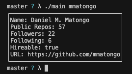

## TACOMA

It's like neofetch, but for github users.

I saw something similar on reddit and decided to recreate it using only golang.
Original inspiration:
[octofetch](https://github.com/azur1s/octofetch)
[Reddit Post](https://www.reddit.com/r/unixporn/comments/qi9pta/oc_octofetch_github_user_stats_fetch_written_in/)

<p>

</p>

## Usage
```sh
tacoma username
```

## Build
```sh
# to run without installing it
make run
# to install to /usr/bin
make install
# to build a binary
make build
```